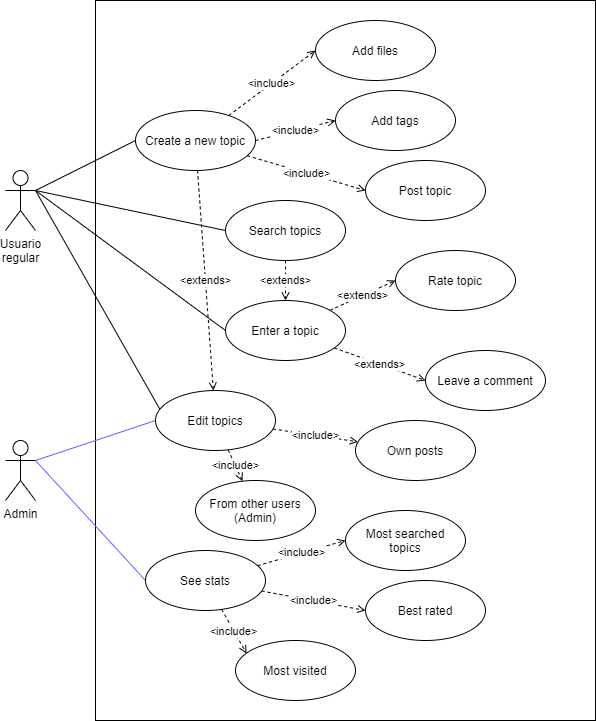
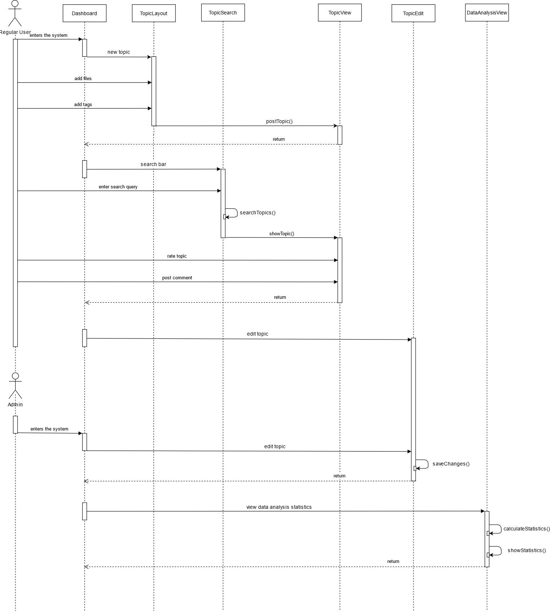
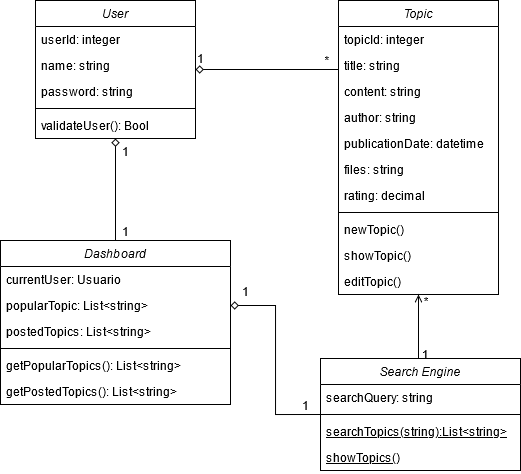
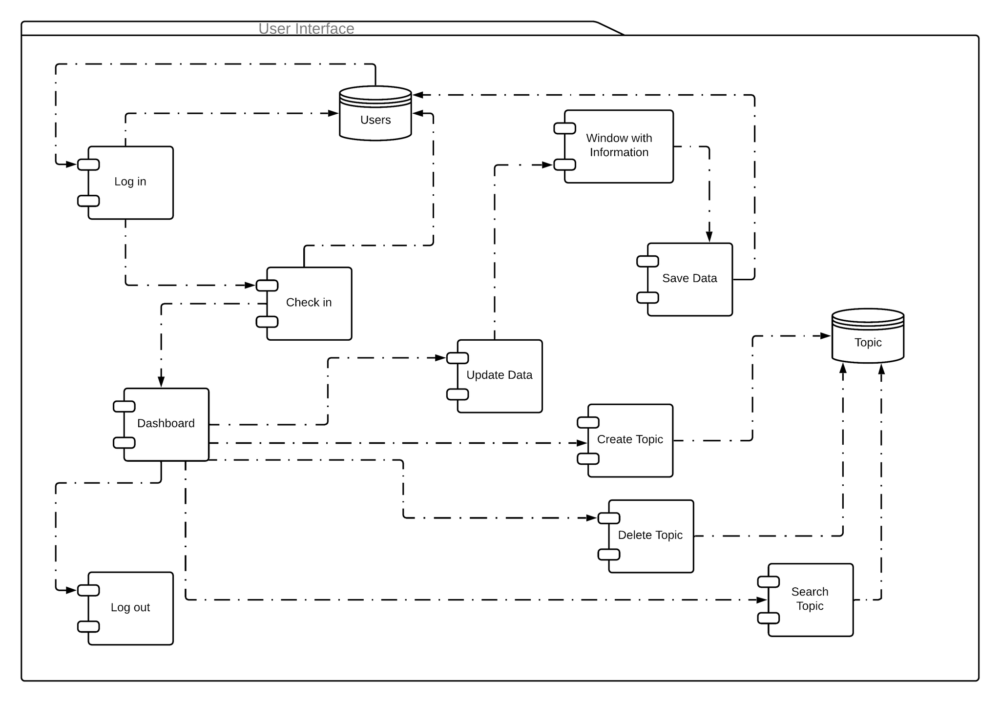
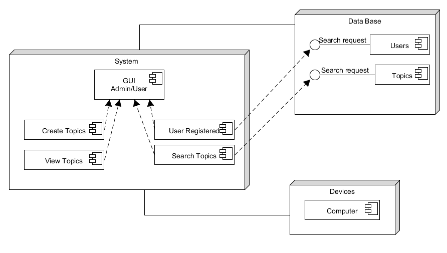

# Introduction

## :trophy: A1.1 Learning Activity
Modeling requirements through UML diagrams

 ### :pencil2: Development
 1. Based on each of the user and system requirements set out above for the case study, draft the requested
modeling diagrams:
+ A diagram that contains the relationships between the different uses cases, only for the scenario in which the users interact with the system making use of the main or central functions according to each case
study. (Include at least 5 elements of the diagram)
+ The sequence diagram that explains the communication between the different GUIs for the use cases of the previous point, considering that the user has already successfully entered the system. (Include at least
5 elements of the diagram)
+ The class diagram for the objects to be instantiated, for the points mentioned above. (Include at least 5
elements of the diagram)
+ A package diagram containing the component diagrams and the relationships between the database, user
interfaces, controllers, or middleware. (Include at least 3 elements of the diagram)
+ The distribution diagrams representing the physical structure of the system such as physical infrastructure, networks, storage and web services, firewall, mobile devices or any other physical resource that will be part
of the system. (Include at least 3 elements of the diagram)

## **Use case diagram**

    

## **Sequence diagram**

    

## **Class diagram**

    

## **Components Diagram**

    

## **Distribution diagram**

    

## Conclusions

#### **Cota Villa Edy Jesus Manuel**
In this activity we make various diagrams that fulfill the function of detailing the structure and interactions of the application that we are going to develop for the conservation of knowledge, the diagrams allow us to understand the interactions that the different users are going to carry out with the software, as well as to see how the information flows both ways, the one that the user provides to the system, as well as the one that the system provides to the user, regardless, the design of these diagrams to allow both programmers and customers to understand the ins and outs of the system that will be developed and that's pretty cool c:
#### **Jaramillo Regino Hector Armando**
In this activity we made diagrams based on the case study, they were distributed among the work team. One of the complicated parts of the activity was the creation of the diagram itself, since in addition to maintaining the format with the elements when adapting it to the business model, we had some doubts. Personally, the sequence diagram was the most complicated of all and we do not know exactly what sequence the program will follow, so we try to make one as close as possible.
#### **Dehesa Zazueta Riggel Alioth**
The diagrams applied helped us modulate different aspects of the proyect for a better understanding of its functionality. Mainly the secuence diagram that describes the secuence of steps that the user can take while using the system; showing potential secuence errors that may happen, complemented by the use case and class diagrams.

#### **Morales Arismendi Cristhian Antonio**
During the development of the diagrams I learned how to apply each one of them within our own project and how to develop each one of them, which in reality I had no knowledge of all the ones that the teacher presented to us in class. This helped me to find some more specific to each project. Each of the elements that make up the UML diagrams are necessary to be able to project what we really want to understand.

## **Reunion Evidence**

    

    

    

### :bomb: Rubric

| Criteria     | Description                                                                                  | Score |
| ------------- | -------------------------------------------------------------------------------------------- | ------- |
| Instructions | Is each of the points indicated in the Instructions section fulfilled?            | 10      |  | 5 |
| Development    | Was each one of the points requested within the development of the activity answered?     | 60      |
| Demonstration  | Does the student introduce himself during the explanation of the functionality of the activity?            | 20      |
| Conclusions  | Is a personal opinion of the activity included by each of the team members? | 10      |

### :bookmark: Links

**Cota Villa Edy Jesus Manuel**

:house: [Repository](https://github.com/CotaVilla/AnalisisAvanzadoDeSoftware_Feb21-Jul21)
:memo: [Activity](https://github.com/CotaVilla/AnalisisAvanzadoDeSoftware_Feb21-Jul21/blob/main/blog/A1.1_ModeladoRequisitos_UML_CotaVillaEdyJesusManuel.md?fbclid=IwAR22XYgp2eGDtgNu_ibLpW32iSVFm15h1Gc7eBuN_j2kkpxtPX5bQ_RD0bc)

**Jaramillo Regino Hector Armando**

:house: [Repository](https://github.com/HectorJaramillo/Analisis-Avanzado-de-Software)
:memo: [Activity](https://github.com/HectorJaramillo/Analisis-Avanzado-de-Software/blob/main/Blog/A1.1%20%20Modelado%20de%20requisitos%20a%20trav%C3%A9s%20de%20diagramas%20UML_HectorJaramillo.md?fbclid=IwAR1fj69WluEC9uG0PpXApGNY_70sF7dyH7CHABqfR1Y_0CKJGpkqZhednGk)

**Dehesa Zazueta Riggel Alioth**

:house: [Repository](https://github.com/RiggelDZ/Analisis-Avanzado-de-Software)
:memo: [Activity](https://github.com/RiggelDZ/Analisis-Avanzado-de-Software/blob/main/blog/A1.1_Requirements_Modeling_Through_UML_Diagrams.md)

**Morales Arismendi Cristhian Antonio**

:house: [Repository](https://github.com/aris-dev/Analisis-Avanzado-de-Software)
:memo: [Activity](https://github.com/aris-dev/Analisis-Avanzado-de-Software/blob/main/Blog/A1.1_Requirements_modeling_through_UML_diagrams.md?fbclid=IwAR22XYgp2eGDtgNu_ibLpW32iSVFm15h1Gc7eBuN_j2kkpxtPX5bQ_RD0bc)

