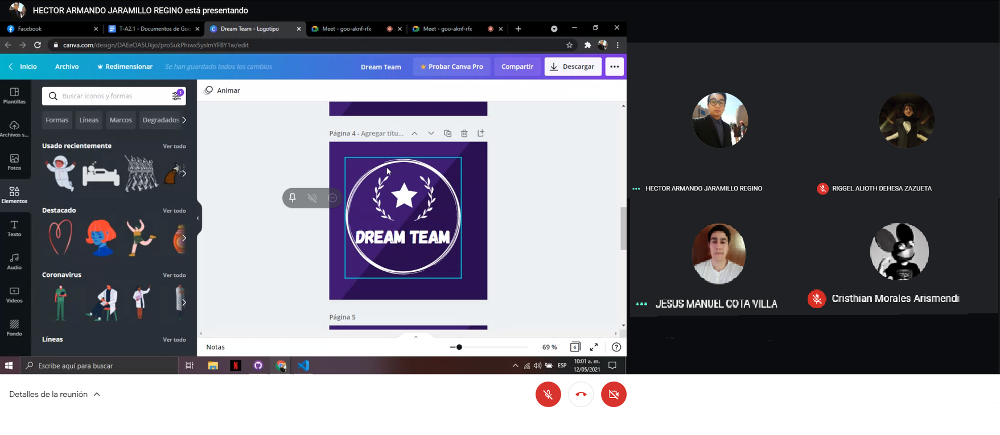
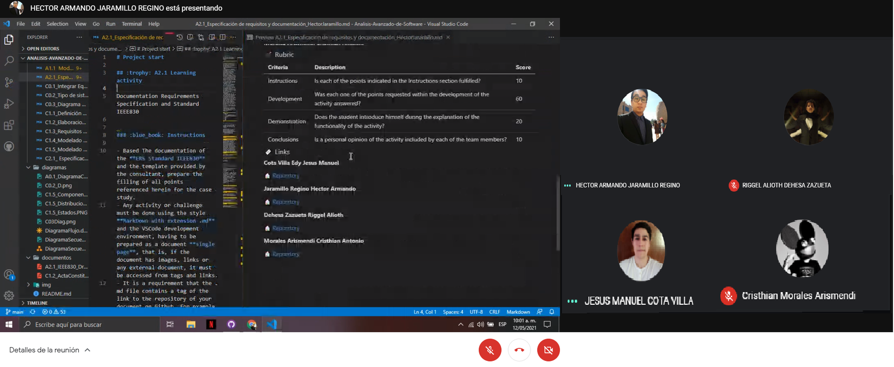
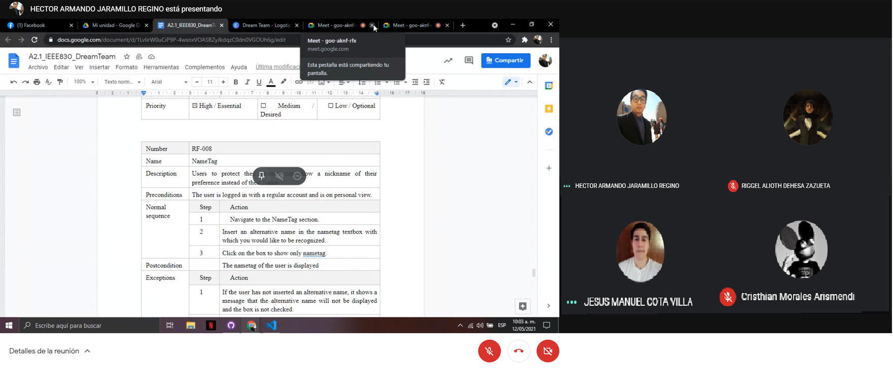

# Project start

## :trophy: A2.1 Learning activity

Documentation Requirements Specification and Standard IEEE830


### :blue_book: Instructions

- Based The documentation of the **ERS Standard IEEE830** and the template provided by the consultant, prepare the filling of all points referenced herein for the case study.
- Any activity or challenge must be done using the style **MarkDown with extension .md** and the VSCode development environment, having to be prepared as a document **single page**, that is, if the document has images, links or any external document, it must be accessed from tags and links.
- It is a requirement that the .md file contains a tag of the link to the repository of your document on Github, for example **Link to my GitHub**.
- At the end of the challenge, the created .md file must be uploaded to github.
- From the **.md** file, a **.pdf** file must be exported with the nomenclature **A2.1_ActivityName_StudentName.pdf**, which must be uploaded to classroom within its corresponding section, to serve as evidence of delivery; being this platform **official** here you will receive the qualification of your activity individually.
- Considering that the .pdf file was obtained from the .md file, both must be identical and show the same content.
- Your repository in addition to having a **readme**. md file inside your root directory, with the information as student data, work team, subject, career, data of the advisor, and even logo or images, it must have a section of contents or index, which are really links or **links to your .md documents**, _avoid using text_ to indicate links internal or external.
- A structure is proposed as indicated below, however any other that supports you can be used to organize your repository.

```
| readme.md
| | blog
| | | Cx.1_NameoftheActivity.md
| | | Ax.1_NameoftheActivity.md
| | diagrams
| | docs
| | html
| | img
| | pdf    
```
___

## :pencil2: Development

1. Insert here the link to the document referred to in the template that the advisor has indicate.

:bookmark_tabs: [Link to the generated document](https://github.com/aris-dev/Analisis-Avanzado-de-Software/blob/main/Documentos/A2.1_IEEE830_DreamTeam.pdf)

## Conclusions

#### **Cota Villa Edy Jesus Manuel**

In this activity we use the standard IEEE830 standard that gives a set of recommendations for the specification of software requirements that was used for the elaboration of a documentation whose final purpose is to document the agreements between the client and the group that will develop the content, In this way, it is necessary to have the stipulated requirements in text and in this way comply with the entire software. Here we define the stakeholders, the requirements and a lot of information necessary for the development of the software.

#### **Jaramillo Regino Hector Armando**
In this activity we made the IEEE 830 format based on a template and in an example, provided by the advisor, throughout the development of the document we had many problems when filling in some fields since the example that was provided did not count With that content, luckily some sections of the document had already been made in previous activities, so that helped us to conclude it without problems.
#### **Dehesa Zazueta Riggel Alioth**
This specific activity expands on requirements specification greatly. We had the opportunity to define requirements in a more professional way with the required format given by the teacher (IEEE830), which sorts requirements by their function in the system. I've personally seen this type of documents used in my workplace, so it certanily is an important aspect of software development.

#### **Morales Arismendi Cristhian Antonio**
Analyzing and specifying requirements may seem like a relatively straightforward task, but in reality, the content of the analysis is very dense and misinterpretation or lack of information abounds. It is very difficult to avoid ambiguity. Although it is not mandatory to perform it, it is of great help, in addition, it is not necessary to start from scratch, since several organizations have identified a standard for SRS of products, services or software and there are templates available for download.


## **Reunion Evidence**

<p align="center">
    
</p>

<p align="center">
    
</p>

<p align="center">
    
</p>


### :bomb: Rubric

| Criteria     | Description                                                                                  | Score |
| ------------- | -------------------------------------------------------------------------------------------- | ------- |
| Instructions | Is each of the points indicated in the Instructions section fulfilled?            | 10      |  | 5 |
| Development    | Was each one of the points requested within the development of the activity answered?     | 60      |
| Demonstration  | Does the student introduce himself during the explanation of the functionality of the activity?            | 20      |
| Conclusions  | Is a personal opinion of the activity included by each of the team members? | 10      |

### :bookmark: Links

**Cota Villa Edy Jesus Manuel**

:house: [Repository](https://github.com/CotaVilla/AnalisisAvanzadoDeSoftware_Feb21-Jul21)

**Jaramillo Regino Hector Armando**

:house: [Repository](https://github.com/HectorJaramillo/Analisis-Avanzado-de-Software)


**Dehesa Zazueta Riggel Alioth**

:house: [Repository](https://github.com/RiggelDZ/Analisis-Avanzado-de-Software)

**Morales Arismendi Cristhian Antonio**

:house: [Repository](https://github.com/aris-dev/Analisis-Avanzado-de-Software)

