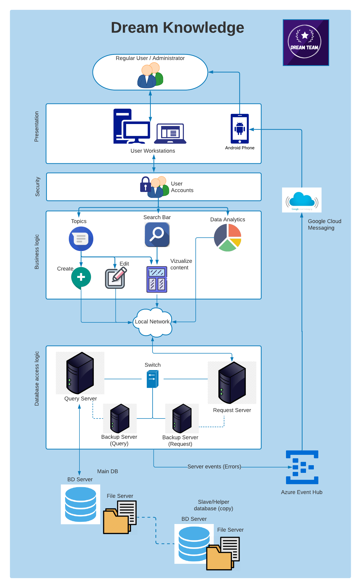
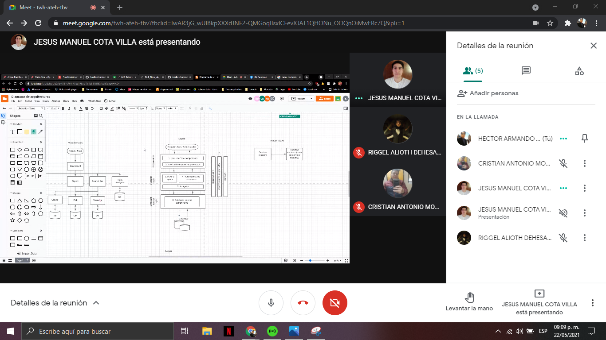
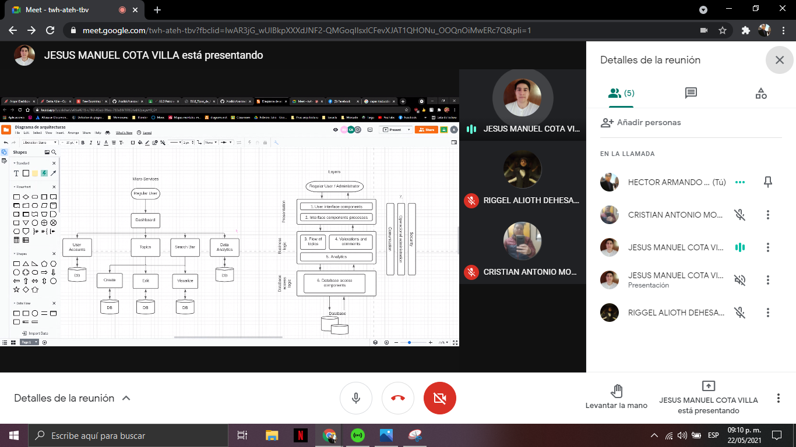

## :trophy: A2.3 Learning Activity
- Software architecture patterns.

:pencil2: Development
1.	Consider applying the following architectural patterns to the case study.

- [x] Client-server architecture pattern.	
- [x] Layered architecture pattern.
- [ ] Architecture pattern model view controller.         
- [x] Micro-service oriented architecture pattern.        
- [ ] Architectural pattern pipes and filters.
- [x] Event-based architecture pattern.            
- [ ] Repository or whiteboard architecture pattern        
- [ ] Publisher/subscriber architecture pattern. 
- [x] Master-slave architecture pattern.          
- [ ] Point-to-point architecture pattern.

2.	Take as a basis the architectural views as well as the elaborated UML diagrams, to apply the pattern that you consider the most appropriate for each of the following scenarios.
    - 2.1 Considering that it is desired to maintain and scale the system, it seeks to develop the application through the decomposition of small independent and isolated services, which consume an external interface to communicate to a database server. 
    - 2.2 Confidentiality and security being attributes or requirements for the case study, it seeks to structure each of the components that are going to be programmed in groups of sub-tasks, where each of these sub-tasks must be communicated an intermediate layer and this to another upper layer.
    - 2.3	Looking for the availability of the system, it is proposed to install two service servers, where they make their requests to a third server in which the database would be stored.
    - 2.4	Identifying that data integrity is a requirement, it is proposed to replicate and synchronize the database stored within the main server to another, considering the main as master and secondary as slave.
    - 2.5	Considering that the client requested that every time a failure occurs, alarms should be provided to the different users regardless of where they are located, it is noted that a service provider must be hired to trigger the alarms of these reach the required users. 

# **Dream Knowledge**

    

## **Reunion Evidence**

    

      

### Conclusions

#### **Cota Villa Edy Jesús Manuel**
In this activity we use architecture patterns to provide a solution to various requirements raised in the activity and that with patterns we have to guide ourselves to describe the developed system, in short we end up combining 5 architecture patterns, the pattern of micro-services, layers, client server, master slave and event-based, with these five we created a diagram that explains the structure of the software, in summary I found this activity very interesting and introduced us to architecture patterns.
#### **Jaramillo Regino Hector Armando**
In this activity we made use of architectural patterns to meet the requirements of this activity. In total we used 5 patterns that were: microservices, layers, client server, master slave and based on events, based on them we made a diagram of each one and finally we put them together to create our architecture. Personally, the simplest pattern was that of the client server since there were not many connections to make and therefore, it represented a problem when implementing it in our architecture.

#### **Dehesa Zazueta Riggel Alioth**
Documenting the software architecture is very important, during the development of this activity we made 5 different structures using the architecture patterns based on microservices, layers, client-server and master-slave events, to translate it into a diagram which encompasses the system to be developed from our case study. The pattern that cost us the most to implement was that of layers, due to the relationships that are created when joining with the other patterns.
#### **Morales Arismendi Cristhian Antonio**
In this activity I learned to be able to apply the knowledge acquired about the software architecture patterns lesson to our use case and learn to include it in a single diagram using the points that the teacher provided us in the activity, these greatly favor us when moment of taking a global approach to see it from different points from the hardware part to the structural part of the platform that actually I learned a lot since I did not know much about the patterns.

### :bomb: Rubric

| Criteria      | Description                                                                                  | Score |
| ------------- | -------------------------------------------------------------------------------------------- | ------- |
| Instructions  | Is each of the points indicated in the Instructions section fulfilled?                       | 10      |  | 5 |
| Development   | Was each one of the points requested within the development of the activity answered?        | 60      |
| Demonstration | Does the student introduce himself during the explanation of the functionality of the activity?            | 20      |
| Conclusions   | Is a personal opinion of the activity included by each of the team members?                  | 10      |

### :bookmark: Links

**Cota Villa Edy Jesús Manuel**

:house: [Repository](https://github.com/CotaVilla/AnalisisAvanzadoDeSoftware_Feb21-Jul21)

**Jaramillo Regino Hector Armando**

:house: [Repository](https://github.com/HectorJaramillo/Analisis-Avanzado-de-Software)

**Dehesa Zazueta Riggel Alioth**

:house: [Repository](https://github.com/RiggelDZ/Analisis-Avanzado-de-Software)

**Morales Arismendi Cristhian Antonio**

:house: [Repository](https://github.com/aris-dev/Analisis-Avanzado-de-Software)
