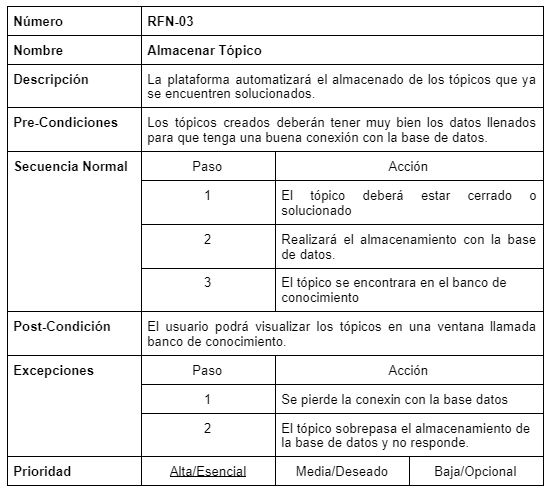

# Inicio del proyecto

## :trophy: C2.1 Reto en clase

Requerimientos funcionales del sistema

### :blue_book: Instrucciones

- De acuerdo con la información presentada por el asesor referente al tema, y basado en el caso de estudio indicado responder la sesión indicada en el desarrollo de la actividad.
- Toda actividad o reto se deberá realizar utilizando el estilo **MarkDown con extension .md** y el entorno de desarrollo VSCode, debiendo ser elaborado como un documento **single page**, es decir si el documento cuanta con imágenes, enlaces o cualquier documento externo debe ser accedido desde etiquetas y enlaces, y debe ser nombrado con la nomenclatura **C2.x_NombredelaActividad_NombreAlumno.pdf.**
- Es requisito que el .MD contenga una etiqueta del enlace al repositorio de su documento en GITHUB, por ejemplo **Enlace a mi GitHub** y al concluir el reto se deberá subir a github.
- Desde el archivo **.md** exporte un archivo **.pdf** que deberá subirse a classroom dentro de su apartado correspondiente, sirviendo como evidencia de su entrega, ya que siendo la plataforma **oficial** aquí se recibirá la calificación de su actividad.
- Considerando que el archivo .PDF, el cual fue obtenido desde archivo .MD, ambos deben ser idénticos.
- Su repositorio ademas de que debe contar con un archivo **readme**.md dentro de su directorio raíz, con la información como datos del estudiante, equipo de trabajo, materia, carrera, datos del asesor, e incluso logotipo o imágenes, debe tener un apartado de contenidos o indice, los cuales realmente son ligas o **enlaces a sus documentos .md**, _evite utilizar texto_ para indicar enlaces internos o externo.
- Se propone una estructura tal como esta indicada abajo, sin embargo puede utilizarse cualquier otra que le apoye para organizar su repositorio.

```
| readme.md
| | blog
| | | Cx.1_NombredelaActividad.md
| | | Ax.1_NombredelaActividad.md
| | diagrams
| | docs
| | html
| | img
| | pdf    
```


## :pencil2: Desarrollo

1. Identifique como mínimo 10 requisitos funcionales del sistema, dándoles un identificador, nombre, detalle o descripción de su funcionalidad, pre-condiciones, secuencia normal, post-condiciones y excepciones.
2. Se propone utilizar la siguiente tabla, sin embargo puede utilizar cualquier otro formato considerando que se deben incluir los elementos solicitados en el punto anterior.


<p align="center">
    
</p>

<p align="center">
    
</p>

<p align="center">
    
</p>

<p align="center">
    
</p>

<p align="center">
    
</p>

<p align="center">
    
</p>

<p align="center">
    
</p>

<p align="center">
    
</p>

<p align="center">
    
</p>

<p align="center">
    
</p>


### :bomb: Rubrica

| Criterios     | Descripción                                                                                  | Puntaje |
| ------------- | -------------------------------------------------------------------------------------------- | ------- |
| Instrucciones | Se cumple con cada uno de los puntos indicados dentro del apartado Instrucciones?            | 20 |
| Desarrollo    | Se respondió a cada uno de los puntos solicitados dentro del desarrollo de la actividad?     | 80      |


:house: [Ir a mi repositorio ](https://github.com/aris-dev/Analisis-Avanzado-de-Software)
